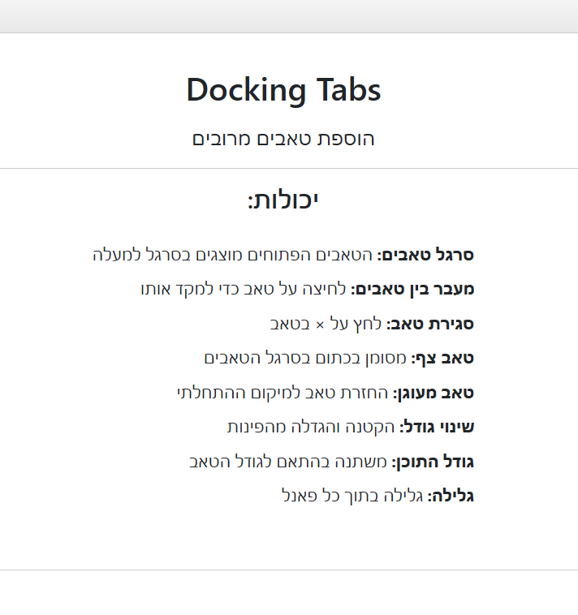
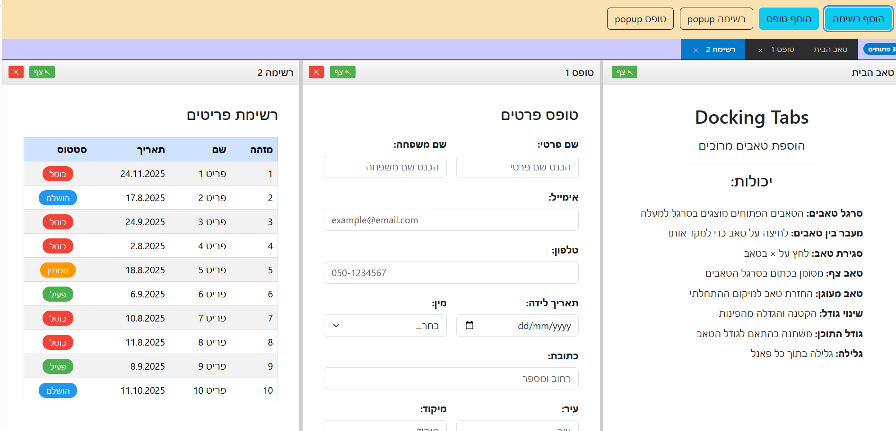
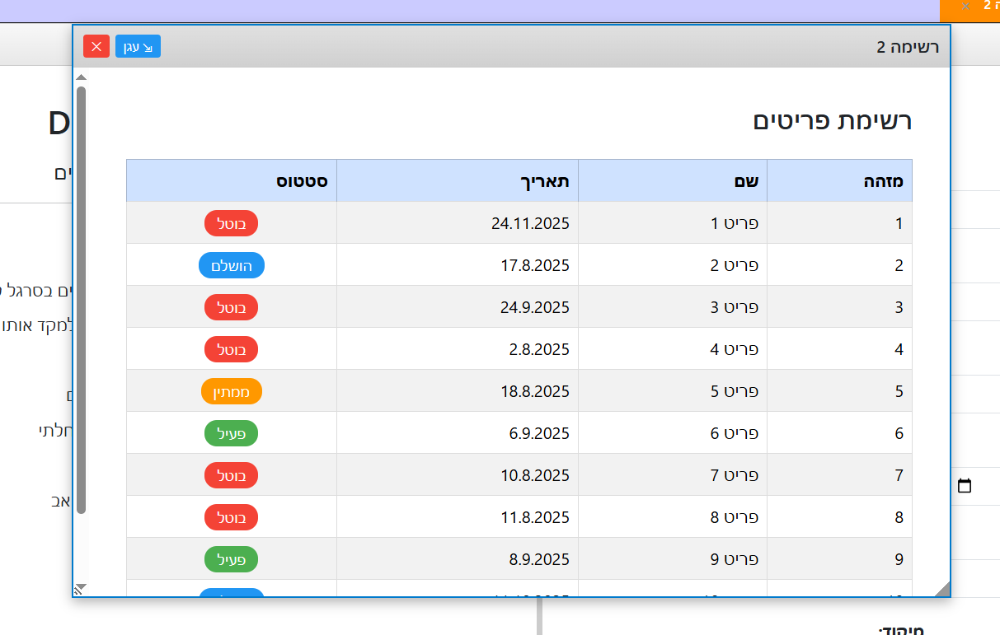
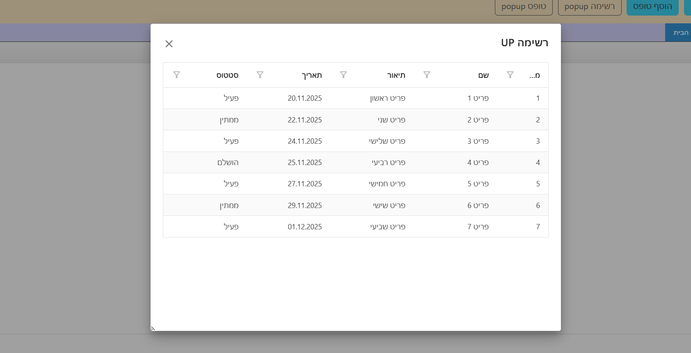
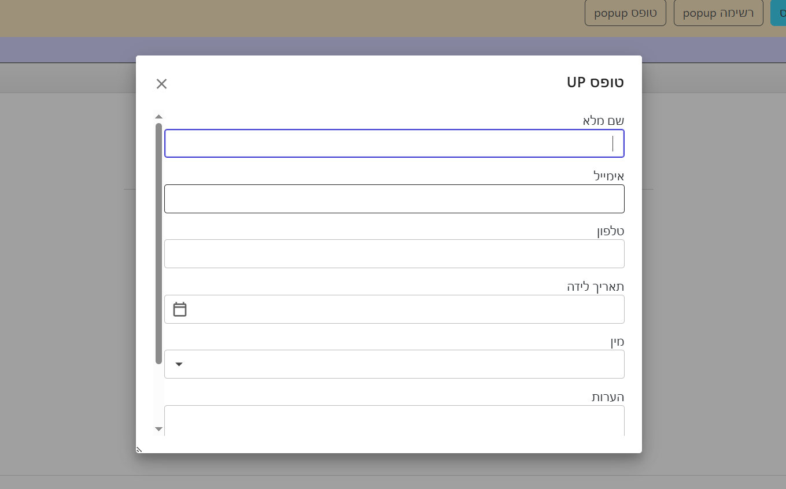
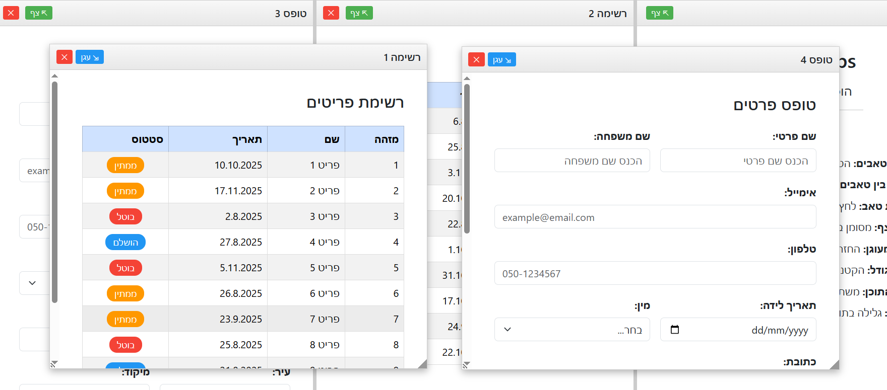

# Blazor WebAssembly - Docking Framework Radzen

## תיאור הפרויקט

פרויקט זה הוא אפליקציית **Blazor WebAssembly** הבנויה כסביבת **SPA --
Single Page Application**, ומשלבת **Docking Framework של Radzen** לצורך
פתיחת חלונות מרובים, טאבים, עיגון, שינוי גודל והצגת קומפוננטות בצורה
גמישה ודינמית.

------------------------------------------------------------------------

## מבנה האפליקציה

    /wwwroot
        /css
        /images
        /js
        index.html
    /Layout
        MainLayout.razor
    /Pages
        Home.razor
        ListComponent.razor
        MyFormComponent.razor
    _Imports.razor
    App.razor
    Program.cs

## תיעוד ויזואלי

